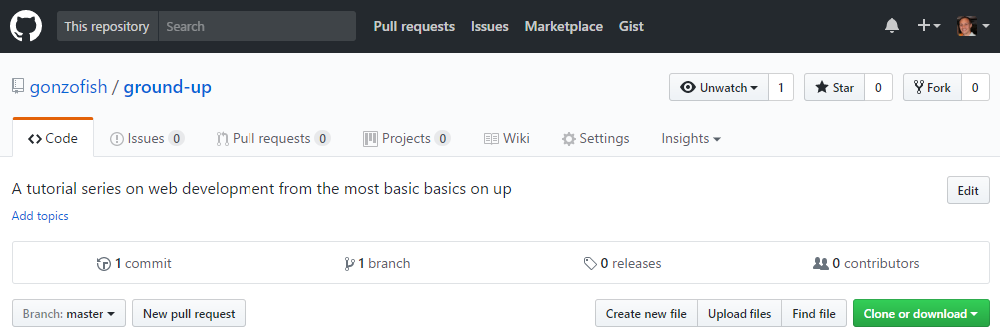
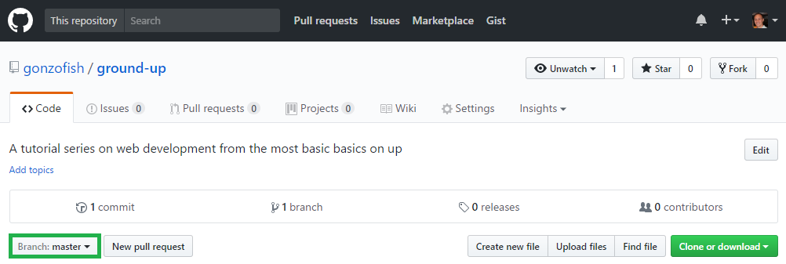
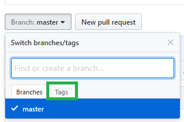
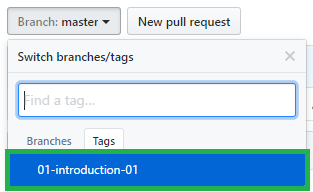

# Introduction 

So you want to learn to program for the web? Great! Programming can be a very
rewarding practice and web programming is no exception. In this article we'll
lay the ground work for how we'll approach the rest of the series.

# What You'll Need

You'll really only need two things for now: a web browser and a text editor. As
you're reading this article, we can safely say you have a web browser. So
that's one box checked off the list.

If you're going to program, you'll need a program you can type code into. There
are a slew of options out there that provide a wide variety of features. Here
is a brief list of free text editors:

- [Visual Studio Code](https://code.visualstudio.com/) (my personal favorite)
- [Atom](https://atom.io/)
- [Brackets](http://brackets.io/)
- [Notepad++](https://notepad-plus-plus.org/)

If you don't feel like downloading a new program, you can also use Notepad (on
Windows), TextEdit (on Mac), or any other built-in text editor your operating
system comes with. However, I highly suggest using one of the first three in the
list above.

There are a bunch of features we won't use to start, but will eventually, so
don't get overwhelmed about all the icons and buttons in your editor. All you
need to know how to do is open a folder, create a file, and save a file.

# What We'll Be Doing

Throughout this series we'll be developing a personal website. As we progress,
the site will become more and more sophisticated. Thanks to the power of
GitHub (the site you're reading this one), we'll have the ability to see the
code step-by-step.

## What's GitHub? What's Git?

As the previous section states, GitHub is the site you're on. To understand
what GitHub provides, it's necessary to understand what
[Git](https://git-scm.org) is. We'll learn what each of these are in more depth
over the course of this series.

For now, understand that Git is software that makes it possible to track every
change made to the text files in a project. GitHub provides a website where we
can store our Git projects and navigate the files and changes easily.

### If You're Familiar with Git

If you're familiar with Git, feel free to clone this project and follow along
by checking out each tag as we progress. Each article will have one or more
tags to show the state of our sample code.

### If You're Not Familiar with Git

Even if you don't know Git, GitHub makes it easy to use features of Git to
browse coe. Let's dive into this! Here's the top of a GitHub page:

Your view will be slightly different because you cannot do things like create a
new file or  modify settings. You may notice a button that says "Branch:
master". This button is how you'll see the changing state of the example code
as the series moves on. The button is highlighted in green in the image below:

If you click that button, it shows a menu with two tabs "Branches" and "Tags".
We'll spend most of our time using the "Tags" menu, which is highlighted in
green:

If we click that, we can see the list of tags for the project. Think of a tag
as a flag we can plant in the ground that identifies a significant point in the
timeline of the project.

We'll have many tags in the timeline of this series. Each of the tags will
follow the format `[article number]-[article name]-[tag #]`. In that list, you'll notice a tag name `01-introduction-01`.

In a new tab or window, open
[the main page of this project](https://github.com/gonzofish/ground-up) and
select the `01-introduction-01` tag.