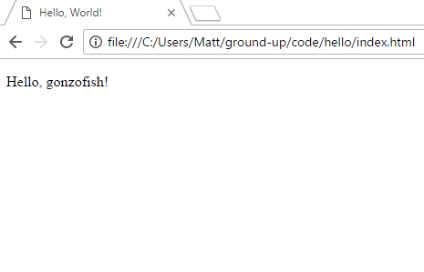

# Introduction 

So you want to learn to program for the web? Great! Programming can be a very
rewarding practice and web programming is no exception. In this article we'll
lay the ground work for how we'll approach the rest of the series.

- [What You'll Need](#needs)
- [What We'll Be Doing](#doing)
    - [What's GitHub? What's Git?](#whats-git)
    - [If You're Familiar with Git](#git-known)
    - [If You're Not Familiar with Git](#git-unknown)

# <a name="needs"></a>What You'll Need

You'll really only need two things for now: a web browser and a text editor. As
you're reading this article, we can safely say you have a web browser. So
that's one box checked off the list.

If you're going to program, you'll need a program you can type code into. There
are a slew of options out there that provide a wide variety of features. Here
is a brief list of free text editors:

- [Visual Studio Code](https://code.visualstudio.com/) (my personal favorite)
- [Atom](https://atom.io/)
- [Brackets](http://brackets.io/)
- [Notepad++](https://notepad-plus-plus.org/)

If you don't feel like downloading a new program, you can also use Notepad (on
Windows), TextEdit (on Mac), or any other built-in text editor your operating
system comes with. However, I highly suggest using one of the first three in the
list above.

There are a bunch of features we won't use to start, but will eventually, so
don't get overwhelmed about all the icons and buttons in your editor. All you
need to know how to do is open a folder, create a file, and save a file.

# <a name="doing"></a>What We'll Be Doing

Throughout this series we'll be developing a personal website. As we progress,
the site will become more and more sophisticated. Thanks to the power of
GitHub (the site you're reading this one), we'll have the ability to see the
code step-by-step.

## <a name="whats-git"></a>What's GitHub? What's Git?

As the previous section states, GitHub is the site you're on. To understand
what GitHub provides, it's necessary to understand what
[Git](https://git-scm.org) is. We'll learn what each of these are in more depth
over the course of this series.

For now, understand that Git is software that makes it possible to track every
change made to the text files in a project. GitHub provides a website where we
can store our Git projects and navigate the files and changes easily.

### <a name="git-known"></a>If You're Familiar with Git

If you're familiar with Git, feel free to clone this project and follow along
by checking out each tag as we progress. Each article will have one or more
tags to show the state of our sample code.

### <a name="git-unknown"></a>If You're Not Familiar with Git

Even if you don't know Git, GitHub makes it easy to use features of Git to
browse coe. Let's dive into this! Here's the top of a GitHub page:


Your view will be slightly different because you cannot do things like create a
new file or  modify settings. Below this top part is a list of files and the
main text, provided by the [README](README.md) file.

You may notice a button that says "Branch: master". This button is how you'll 
see the changing state of the example code as the series moves on. The button 
is highlighted in green in the image below:


If you click that button, it shows a menu with two tabs "Branches" and "Tags".
We'll spend most of our time using the "Tags" menu, which is highlighted in
green:


If we click that, we can see the list of tags for the project. Think of a tag
as a flag we can plant in the ground that identifies a significant point in the
timeline of the project.

We'll have many tags in the timeline of this series. Each of the tags will
follow the format `[article number]-[article name]-[tag #]`. In that list, you'll notice a tag name `01-introduction-01`.


In a new tab or window, open
[the main page of this project](https://github.com/gonzofish/ground-up) and
select the `01-introduction-01` tag.

Where'd all the files go?! Well the `01-introduction-01` tag was made before
the first article was started, so it's not part of that tag. If you select
the "Branches" tab from the button menu and click `master`, you'll see all the
files of the project again.

And now you know some GitHub basics as well as some Git terminology! In a later
article, you'll start using Git and create your own project in GitHub.

## Let's Write Some Code

Now let's get to what you came here to do: code. We're going to create our very
first webpage. On the page we'll just output some text that says `Hello, [your
name]!` In the programming world this is an ubiquitous example called a
["Hello, World!" program](https://en.wikipedia.org/wiki/%22Hello,_World!%22_program).

1. Create a folder somewhere on your computer called `hello`.
2. In your text editor (I'll be using Visual Studio Code), open up the `hello`
folder.
3. Create a new file called `index.html`.
4. Add the following code to your file, replace `[your name]` with your name. You can also see this file in the project's
[`code/hello`](code/hello directory).

    ```html
    <!DOCTYPE html>
    <html lang="en">
        <head>
            <title>Hello, World!</title>
        </head>

        <body>
            <p>Hello, [your name]!</p>
        </body>
    </html>
    ```
5. Get the location of the file (it will be something like 
`C:\Users\my-account\hello\index.html` or `/Users/my-account/hello/index.html`)
and type that into the address bar of your web browser. And you'll see
something similar to the following:

    <a name="hello-image"></a>

### Understanding What Your Wrote

You've create your first webpage! But maybe you don't know _what_ you've done.
Well, you've coded using
[Hypertext Markup Language](https://en.wikipedia.org/wiki/HTML), also known as 
HTML.

Let's look at the code line-by-line.

```html
<!DOCTYPE html>
```

This is known as a [document type declaration)(https://en.wikipedia.org/wiki/Document_type_declaration). 
As its name implies, this tells the web browser what type of code we're
providing in the HTML file. Ok, so now the browser knows our code is HTML.

```html
<html lang="en">
```

This is our first real HTML "tag". This tag, `html`, tells the browser "here's
where the actual HTML begins". It's know as the "root" element of an HTML
document.

There's also the `lang="en"` inside the tag. `lang` is known as an attribute.
There are many tags and many attributes which we'll learn as we go on. For the
`html` tag, the `lang` attribute lets the browser know what the language of
our HTML document's content is. By specifying `"en"` we're saying that it is
English. There are many supported languages, but we'll be specifying English.


```html
    <head>
```

The `head` tag declares an invisible section of our HTML. In the `head` tag we
specify descriptive information about our page. Again, we'll investigate this
further as the series progresses, but the big takeaway is that the tags and
information we put into the head does not appear in the browser.

```html
        <title>Hello, World!</title>
```

A `title` tag declares the text to be displayed in the tab or window header. We
are telling the browser, make the tab say `Hello, World!`. If you look at your
browser tab, you'll see that very title (see [the image above](#hello-image)).

```html
    </head>
```

And this is a closing tag. It says "ok, we're done describing the `head`
section". Many tags require a closing tag, but not all.

```html
    <body>
```

Now we start the body of our HTML. The body is where all the content that we
want to display on our page will go.

```html
        <p>Hello, [your name]!</p>
```

The `p` tag is for "paragraph". When we want to display a block of text a
paragraph is a a good tag to put it in becaues it gives us a visual separation
from any text around it. If you want to see this in action, add some more `p`
tags to the `body`.

```html
    </body>
</html>
```

And, finally, we close the `body` and `html` tags to complete our document.

## And That's It (For Now)

Congratulations! You've installed a text editor, learned about GitHub and Git,
and even coded up your first webpage! In the next lesson, we'll learn about
more HTML elements.

The tag for the code to now is [`01-introduction-02`](https://github.com/gonzofish/ground-up/tree/01-introduction-02)