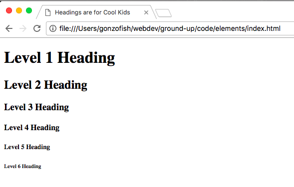
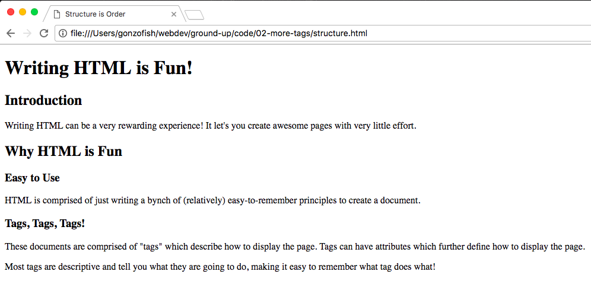
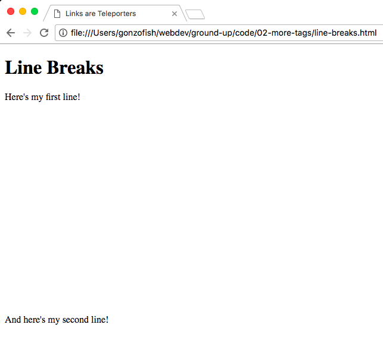
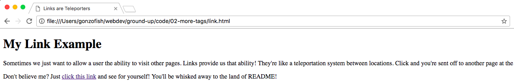
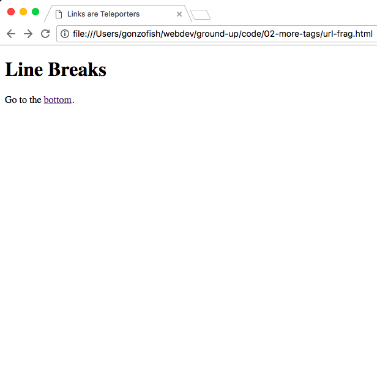
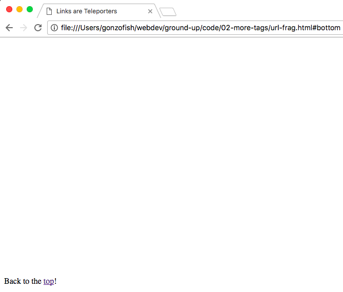
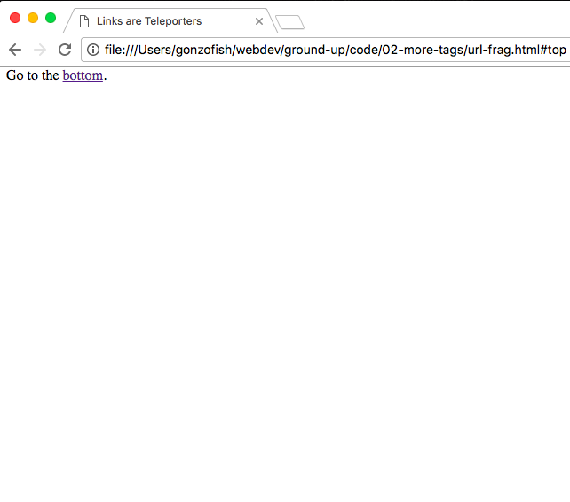
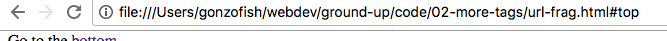

# More Elements

In [the previous article](01-introduction.md) we installed a code editor,
learned the absolute basics of GitHub, and wrote our first page. Hopefully
it all was pretty straightforward!

Now we'll be learning more HTML. As we learned in the previous article, an HTML
document is made up of a bunch of "tags" (not to be confused with the tags of a
Git project). Some developers may call tags "elements"--so don't be confused if
that term pops up throughout the article.

## <a name="for-structure"></a>Tags are for Structure

If you don't know, the Internet as we know it today was originally just a way
of quickly sharing documents with others. That's why we call it an HTML
document. As it follows, many HTML tags are aimed at structure a text document.
Let's dive in!

## Headings

The specification for HTML describes six different levels of "headings". As its
name implies, these tags allow us to provide six different levels of section
headings. Let's look at a trivial example (available at
`code/02-more-tags/headings.html`):

```html
<!DOCTYPE html>
<html lang="en">
    <head>
        <title>Headings are for Cool Kids</title>
    </head>

    <body>
        <h1>Level 1 Heading</h1>
        <h2>Level 2 Heading</h2>
        <h3>Level 3 Heading</h3>
        <h4>Level 4 Heading</h4>
        <h5>Level 5 Heading</h5>
        <h6>Level 6 Heading</h6>
    </body>
</html>
```

The output is going to look something like below:



So each of headings come with some built-in style. This is dictated by the
specification for HTML. Once we get to about level 4 or 5, things start to be a
little small to read. In forthcoming articles, we'll see that we can add some
styling to improve the readability of these headings using a technology known
as Cascading Stylesheets (CSS).

Using headings gives structure to the page. Take the following page (which is
available at `code/02-more-tags/structure.html`):

```html
<!DOCTYPE html>
<html lang="en">
    <head>
        <title>Structure is Order</title>
    </head>

    <body>
        <h1>Writing HTML is Fun!</h1>

        <h2>Introduction</h2>

        <p>
            Writing HTML can be a very rewarding experience! It let's you
            create awesome pages with very little effort.
        </p>

        <h2>Why HTML is Fun</h2>

        <h3>Easy to Use</h3>

        <p>
            HTML is comprised of just writing a bynch of (relatively)
            easy-to-remember principles to create a document.
        </p>

        <h3>Tags, Tags, Tags!</h3>

        <p>
            These documents are comprised of "tags" which describe
            how to display the page. Tags can have attributes which
            further define how to display the page.
        </p>

        <p>
            Most tags are descriptive and tell you what they are
            going to do, making it easy to remember what tag does
            what!
        </p>
    </body>
</html>
```

This is a somewhat silly page, but it illustrates a point about structure. Here
is what the page looks like when rendered:



It may be obvious to your eye, but the different sizes of the headings gives
our page structure that the browser understands. Think of the tags as creating
a sort of outline:

- Writing HTML is Fun!
    - Introduction
    - Why HTML is Fun
        - Easy to Use
        - Tags, Tags, Tags

Why is this structure important? Well, as you can see, it makes the page easier
for site visitors to read. A reader can clearly see that "Easy to Use" and
"Tags, Tags, Tags" are sub-sections of "Why HTML is Fun" and can also see that
the title is "Writing HTML is Fun!"

More importantly, however, is that utilizing proper tags for structure, like the heading tags, makes our pages more accessible.

Visually impared readers of our site can not see the styles that headings provide. If we were to use a bunch of `<p></p>` tags, it would just be a
long page of text which conveyed no information about the role of that text.

Using headings allows our pages to provide the outline to software which reads
the screen to visually impaired users. When you cannot use a mouse or see the content, it is a significant advantage to be able to use an outline to
jump from section to section. Headings are just one way of conveying such
structure to readers.

## Line Breaks

For a long time (in web years), the line break was one of the most used tags.
It provided website creators the ability to space things out. Thanks to CSS and
evolving best practices, line breaks aren't up on the pedestal that they once
were.

But, since they are so prevelant throughout the web, you should know that the tag for a line break is `<br>`. That's it, no closing tag, just `<br>`.

Here's an example (`code/02-more-tags/line-breaks.html`):

```html
<!DOCTYPE html>
<html lang="en">
    <head>
        <title>Links are Teleporters</title>
    </head>

    <body>
        <h1>Line Breaks</h1>

        <p>Here's my first line!</p>
        <br><br><br>
        <br><br><br>
        <br><br><br>
        <br><br><br>
        <br><br><br>
        <br>
        <br><br>
        <p>And here's my second line!</p>
    </body>
</html>
```

Which displays out as:



While there is some spacing created by the paragraph tags (`<p></p>`), the bulk
of the spacing is done by using 18 `<br>` tags!

## Links

Everyday we use links in webpages to jump from page to page or website to
website. They come in many styles, but the default is a bright blue which turns
purple when you've visited that site.

Links are one tag that does not easily convey its purpose. Here's an example
(`code/02-more-tags/link.html`):

```html
<!DOCTYPE html>
<html lang="en">
    <head>
        <title>Links are Teleporters</title>
    </head>

    <body>
        <h1>My Link Example</h1>

        <p>
            Sometimes we just want to allow a user the ability to visit
            other pages. Links provide us that ability! They're like a
            teleportation system between locations. Click and you're
            sent off to another page at the speed of light!
        </p>

        <p>
            Don't believe me? Just
            <a href="https://github.com/gonzofish/ground-up/blob/master/README.md">click this link</a>
            and see for yourself! You'll be whisked away to the land of
            README!
        </p>
    </body>
</html>
```

And it's output:



In this example we have one new tag `<a></a>`. What's the "a" stand for?
"Anchor," what else? While this isn't obvious to us now, the term anchor made
more sense back in the earliest days of the web. The anchor tag was on [the
world's first webpage](http://info.cern.ch/hypertext/WWW/TheProject.html).

Anchor's can use an attribute named `href`. While it may look like this word is
pronounced `ha-ref`, it's actually `h-ref` and stands for "Hypertext
REFerence". It basically says, "this anchor will take the user to this URL".

### In-Page Links

We can also let our anchors navigate to different locations within that page. This can be done by using a "URL fragment" and giving a tag within our
page an `id` attribute.

Take this page (`code/02-more-tags/url-frag.html`):

```html
<!DOCTYPE html>
<html lang="en">
    <head>
        <title>Links are Teleporters</title>
    </head>

    <body>
        <h1>Line Breaks</h1>

        <p id="top">Go to the <a href="#bottom">bottom</a>.</p>
        <br><br><br>
        <br><br><br>
        <br><br><br>
        <br><br><br>
        <br><br><br>
        <br><br><br>
        <br><br><br>
        <br><br><br>
        <br><br><br>
        <br><br><br>
        <br><br><br>
        <br><br><br>
        <br><br><br>
        <br><br><br>
        <br><br><br>
        <br><br><br>
        <br><br><br>
        <br><br><br>
        <br><br><br>
        <br><br><br>
        <p id="bottom">Back to the <a href="#top">top</a>!</p>
    </body>
</html>
```

We use a bunch of line breaks to push the 2nd line off-screen. Then we employ
the fragments to tell the page where we want to go. The structure of a fragment
is a pound sign followed by the `id` we want to jump to.

You can see we've given `id` attributes to the two lines--`top` to the first
line and `bottom` to the second line. When the links are clicked they jump
between the two locations on the page.

Here's how the page initially looks:



After we click the link to the bottom:



And after we clicked the link back to the top:



The browser also adds the url fragment to the end of the address in
the address bar:



One thing to note is that clicking the "top" link doesn't go to the top of the
page, but rather to the element with `id="top"`. What the browser attempts to
do is put the element with that `id` at the top of the page, which is why we
only see "Go to _bottom_." Conversely, since there is nothing to display below
"Back to the _top_!" the browser cannot push it to the top of the window and it
stays at the bottom of the window.